# Hugo Calendar Widget

## Introduction

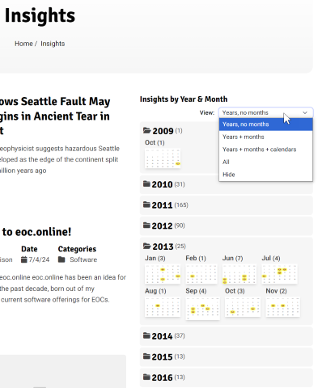
Full-featured content management systems like DNN (or Drupal) often provide
calendar components or widgets that show date of blogs/posts/insights. Inserted
into pages on the website, users can see when blog posts were published. Often
users can select blogs by year, month, or date.

_Want to find your New Year or quarterly posts? Trivial!_

Additionally this widget creates an _"**Archive**"_, i.e., pages for each year,
month and day, containing previews of the blogs posted during that time span.

This article shows how to create such a calendar widget and archive using the
[Hugo static web site generator](https://gohugo.com) and its
[partial template](https://gohugo.io/templates/partial/) capabilities.

A live, working example of this can (in the 'near' future) be found at
https://eoc.online/insights.

> Personally I've described my blog entries as 'Insights' in the code, but one
> could use 'articles', 'posts', or 'blogs' as you prefer.

---

## Views & Functionality

### Archive

After installation (see below) and the site rebuilt, notice the site now has a
top level page, "Archive", with sub-pages as determined by the Archive front
matter in your pages: see below under "Archive Taxonomy" for details on how to
make this happen.

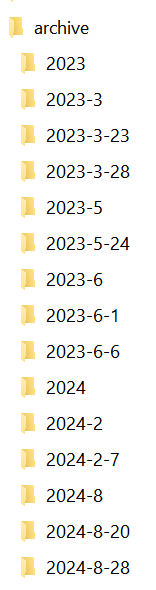

### Calendar Widget

This Hugo calendar widget typically would be put into a page sidebar, much as
the Categories or Tag widgets are on many Hugo sites.

The Hugo calendar widget provides 5 views. Users can select them from the
dropdown menu as shown below. On hover, tooltips provide a bit more explanation.

- All views are responsive: they shrink & grow depending on media & browser
  screen size.

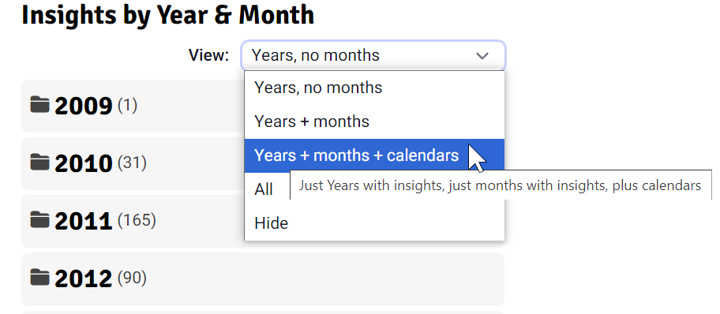

The following describes each view in more detail, detailing some of the user
interaction and features for each view.

### View 1: Years (Default)

> "Just Years with insights, no months"

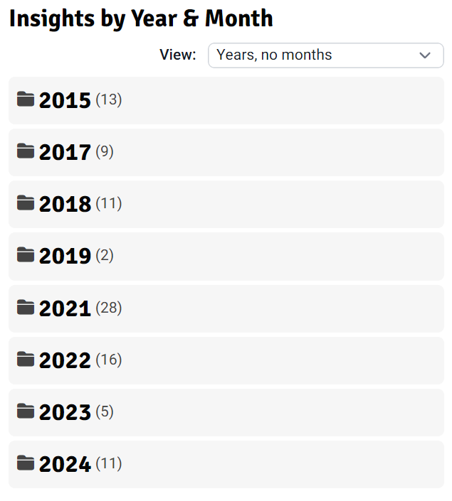

The initial (default) view is shown above.

- All folders are initially closed

- Number in parentheses show the number of articles for the year.

- Years with no posts are hidden by default.


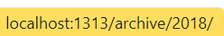

- As shown above, users can click on the folder icon (the light blue area on
  hover) to open the year's folder, thus showing months.

- Clicking on the darker blue (background for the actual year, e.g., 2018 as
  shown above on hover) will navigate to the archive of the year's posts.

- Multiple folders can be independently opened and closed as desired.

- A 'quirk' of the current code, that I've left as a 'bonus feature', is that on
  initial selection, opened years also show mini-calendar months. This doesn't
  happen once the 'Years + Months' view is chosen, but only for the 'Years +
  Months + Calendar' or 'All' views.

### View 2: Years + Months

> "Just Years with insights, just months with insights"

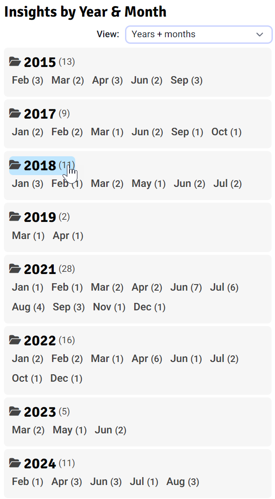

Selecting "Year + Months" in the View dropdown opens all years that have any
blogs, displaying the months that have blogs.

- Once opened, folders can be closed by clicking on the light blue header a
  second time.

- The entire grey block can also be clicked anywhere (except as described below)
  to close that particular year.

- Months are displayed with the number of blogs/insights/posts/articles after
  them.

- The months turn light blue when hovered over and if clicked will navigate to
  an archive previewing blogs for that month.

### View 3: Years + Months + Calendars

> "Just Years with insights, just months with insights, plus calendars"

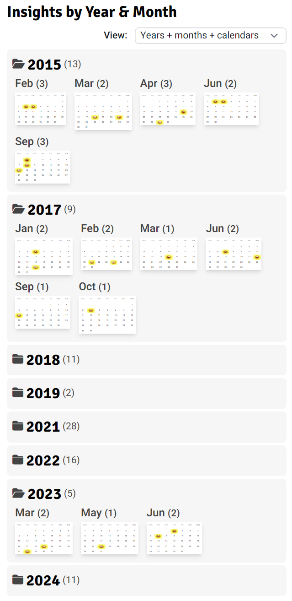

**Notes:**

- The addition of the mini-calendar months provides a visual display of those
  months with blogs.

- Hovering on a day with blog posts displays the number of posts for the day.

  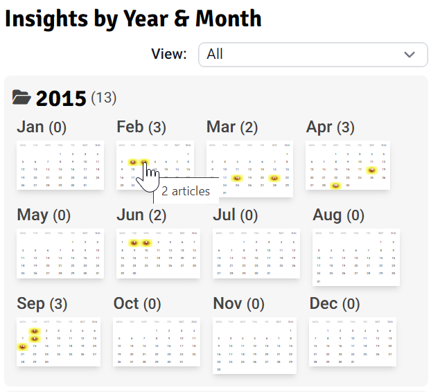

  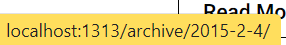

- Clicking on a day with blog posts navigates to the archive page with previews
  of that day's posts.

- N.B., Clicking near, but not on a day with posts is the same as clicking a
  year's background: it closes the year!

### View 4: All

> "All Years, display months and calendars"

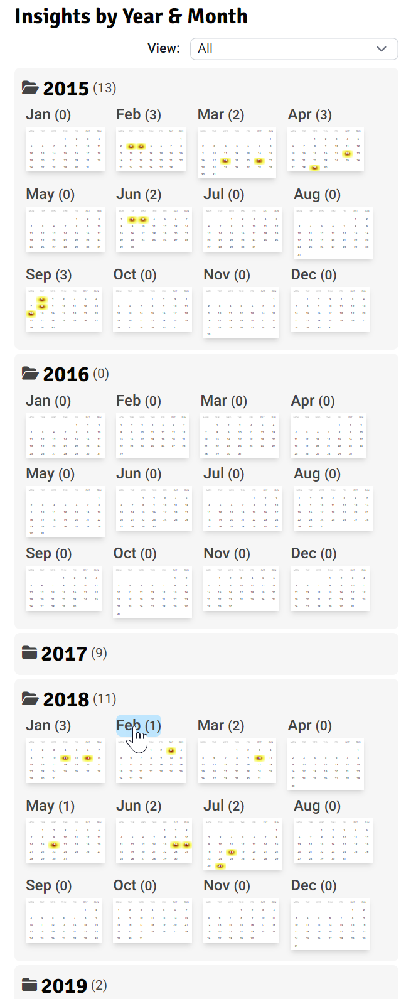

Only this view shows ALL years and ALL months - i.e., even those with _zero_
blog posts or articles. (This was the only option in the original widget I
started with.)

- Clicking on a month with no blog entries is the same as clicking a year's
  background: it closes the year!

### View 5: Hide

> "Hide entire Calendar widget"

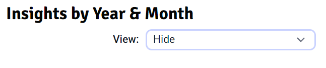

This just hides the widget body, say if the user wants to maximize screen real
estate for other purposes. The widget heading remains visible.

---

## Installation: Calendar Widget

The directory structure at
[www.github.com/eoconline/hugo-calendar-widget](www.github.com/eoconline/hugo-calendar-widget)
should basically match your existing Hugo site.

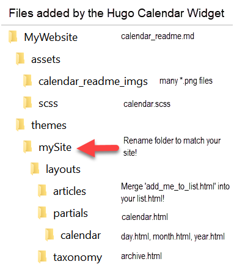

1. If so, rename the 'themes/mySite' directory (above) to match your website
   name and then drop our files into your existing website - <u>no files should
   be overwritten</u>!

2. Edit your existing` /assets/scss/custom.scss` file & add the following line:
   `@import "./calendar.scss";`

3. If you are not already using
   [Tailwind CSS](<[https://tailwindcss.com/](https://tailwindcss.com/)>) to
   style your website, you will need to enable it as shown at
   [Tailwind CSS installation](https://tailwindcss.com/docs/installation).

4. I'm unclear how to ensure availability of the two free "Font Awesome 6 Free"
   icons referenced by the above scss file: open-folder & closed-folder. You may
   need to `npm install fontawesome`

   or maybe add another line to your `/assets/scss/custom.scss` file, i.e.:
   `@import "https://cdnjs.cloudflare.com/ajax/libs/font-awesome/6.6.0/css/all.min.css";`

5. Edit the page where you would like the calendar widget to appear. (I changed
   my `\themes\mySite\layouts\articles\list.html` file.) Add the following code.
   (I added it just below the `<!-- sidebar -->`comment.)

   ```Hugo
   <!--
        Hugo Calendar widget:
        ©www.github.com/eoc.online/hugo-calendar-widget
        'Insights' refer to 'blogs' or 'posts' in this context.
      -->
   {{ $fromYear := (index .Pages.ByPublishDate 0).Date.Format "2006" }}
   {{ $fromMonth := (index .Pages.ByPublishDate 0).Date.Format "1" }}
   {{ partialCached "calendar" (dict "context" . "fromYear" $fromYear "fromMonth" $fromMonth "to" (now.Format "2006") "toMonth" (now.Format "1") "pages" .Site.Pages) }}
   ```

   (NOTE: in the last line above, you can easily change the time span for what
   years and months are shown in the widget. More details are below in the
   'Widget Parameters' section.)

### Installation: Archive Taxonomy

To create the Archive, we use the native
[Hugo taxonomy](https://gohugo.io/methods/site/taxonomies/)
([also this](https://gohugo.io/content-management/taxonomies/)) facility. It
auto-generates Archive pages.

1. Edit the existing `hugo.toml` file at the root of your web site, creating the
   archive as a taxonomy by inserting a line with the singular & plural form of
   the new taxonomy term under the `[taxonomy]` group:

#### hugo.toml

```toml
# adding 'archive' taxonomy
[taxonomies]
    archive = 'archive' # for Calendar widget (see \calendar_readme.md)
```

N.B., typical form for taxonomies in the `hugo.toml` file is <SINGULAR_NAME> =
<PLURAL_NAME>, but I want the site's final directory name to be 'Archive', not
'Archives', so strayed here from tradition. Just match whatever 'plural' term
you use in the front matter as shown next.

Next, edit all the pages you desire rendered by the calendar widget. (I edited
those in my `\content\english\articles` directory.) Add the following front
matter to all pages you wish calendar-ized. Additional front matter is fine &
ignored by the widget.

### my-article.md

```MD
+++
date = "2024-03-06T21:27:05.454Z"
PublishDate = "2024-03-06T21:27:05.454Z"
archive = ["2024","2024-03","2024-03-06"]
+++
```

In this example the page will be rendered in the archive of the Year 2024, the
month of March and within the specific day’s archive at the 6th of March, 2024.

---

## Programmable Modifications

Feel free to modify current functionality if you are comfortable programming.
Hugo is well documented, but uses the Go language internally if you need to
delve into that.

The following provides some guidance.

### Functionality by file

### list.html

As mentioned above in the first installation section, you need to put a call to
the calendar widget where you want it to appear, perhaps above or below other
partials components like Categories or Tags?

These few lines use `.Pages.ByPublishDate` to derive a default starting year and
month for the calendar widget - the oldest post in the `.Pages` collection, but
easily changed to serve your needs.

### calendar.html

That call to the calendar widget is handles by the main partial file,
`/layouts/partial/calendar.html`.

Go commands are handled during the compile phase. New for this edition is a
small section of Javascript that adds a View dropdown as exhaustively
demonstrated above. Modifying the view results in calls to handler routines that
change various class modes from `hidden` to the default, display.

The widget parameters the calendar partial receives are provided using a `map`
using `dict` (_'dict'ionaries provide key-value-maps like
`dict key1 value1 key2 value2 ...`_).

Context-based functions obviously need access to the larger context and data,
and thats the first parameter.

### year.html

Calendar.html then repeatedly calls the `year.html` partial to render a single
year. (Sub-partials are organized into sub-folder `layouts/partials/calendar/`.)

### month.html

The year partial then repeatedly calls `months.html` to render just the name of
the months to be rendered.

### day.html

The month partial in turn calls `day.html` to render the mini-calndar month
figures.

### Widget Parameters

The calendar widget is called using the following line:
`{{ partial "calendar" (dict "context" . "fromYear" $fromYear "fromMonth" $fromMonth "to" (now.Format "2006") "toMonth" (now.Format "1") "pages" .Site.Pages) }}`

The parameters/arguments are described next.

#### context

This is crucial to pass the current context into the partial. Otherwise partials
don't have access to the parent context.

#### fromYear

This defaults to the oldest article/blog.

Alter it to define a different beginning year range for the calendar. Use a four
digit format: **YYYY**.

#### fromMonth

This defaults to the first blog/article's month. _If hardcoding something else,
do <u>not</u> use a leading zero!_

#### toYear

This defaults to the current year.

Alter it if you wish to reduce the years shown by the calendar. Use a four digit
format: **YYYY**.

#### toMonth

This defaults to the current month.

Alter it if you wish to reduce the calendar range. \__If hardcoding something
else, do <u>not</u> use a leading zero!_

#### pages

Pages refers to a Hugo collection of pages/articles/blogs/posts/insights to
extract dates for the calendar from. This provides great flexibility to display
calendars for other collections!

### Styling

The original project just used an expanded `assets/scss/calendar.scss` file. The
`calendar.html`, `year.html` and `month.html` files now incorporate
[Tailwind CSS](https://tailwindcss.com/) to eliminate run-time processing. The
mini-calendar months (i.e., the `day.html` file) still rely on the current
`assets/scss/calendar.scss` file.

---

## Credits & Source

This effort began in 2017 with the great work of RWI (known to me only by their
initials). Their original web domain (**gohugohq**.com) now delivers spam, but
fortunately the 2017 original article is available by the Way Back Machine!

https://web.archive.org/web/20191212005200/https://gohugohq.com/partials/activity-calendar-posts/

Significantly updating the original code & documentation, I've also created a
bunch of different user selectable views. I'm re-releasing the project under the
MIT license. The current open source code for this project is at:
[www.github.com/eoconline/hugo-calendar-widget](<[www.github.com/eoconline/hugo-calendar-widget](http://www.github.com/eoconline/hugo-calendar-widget)>).

---

## Issues

This is provided free of charge. You are encouraged to submit change-requests
and issues as you find & resolve issues for problems or additional
functionality. Those are accepted at
[https://github.com/eoconline/hugo-calendar-widget](https://github.com/eoconline/hugo-calendar-widget).

## Support Future Development

Let me know if you appreciate & use this widget!

- Star the repo above
- I am always looking for new ideas and feedback: Send a note to HugoCalendar
  (at) eoc.online
- If you find this useful, buy me some coffee:
  [donate via Paypal](https://www.paypal.me/vashjuan)
